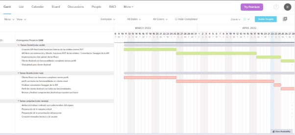
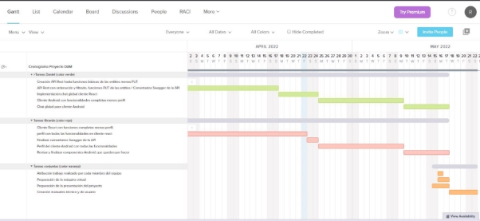

<h1 align="center">Cronograma</h1>
 
<h2 align="center">Red social de videojuegos, “Player2”</h1>
 
<h2 align="center">IES Puerto de la Cruz - Telesforo Bravo</h1>

 
 
<h2 align="center">Alumnos:</h1>
<h4 align="center">Ricardo Baloira Armas</h4>
<h4 align="center">Daniel Barroso Rocío</h4>
 
<h2 align="center">Tutor:</h1>
<h4 align="center">Juan Carlos Pérez Rodríguez</h4>
 
 

**Cronograma**

Fecha inicio: 11 marzo

- Planificación y creación de BBDD e introducción de datos: 11 marzo
- Creación API Rest hasta funciones básicas de las entities menos PUT (Daniel) y cliente React con funciones completas menos perfil (Ricardo):12 marzo - 25 marzo (15 días = 45 horas por miembro)
- API Rest con ordenación y filtrado, funciones PUT de las entities y comentarios Swagger (Daniel), componentes del perfil del cliente React y ultimar componentes del cliente (Ricardo): 26 marzo - 17 abril (23 días = 69 horas Daniel) // 26 marzo - 22 abril (28 días = 84 Ricardo)
- Realización del chat (Daniel), comentarios Swagger de la API (Ricardo): 18 - 24 abril (5 días = 15 horas Daniel) //  23 - 24 (2 días = 6 horas Ricardo)
- Creación cliente Android con funciones completas menos perfil del cliente (Daniel) y perfil del cliente Android con todas las funcionalidades (Ricardo): 25 abril - 9 mayo (15 días = 45 horas por miembro)
- Chat global del cliente Android (Daniel) y revisar y ultimar componentes del cliente Android que queden por hacer (Ricardo): 10 mayo - 17 mayo (8 días = 24 horas por miembro)
- Creación manuales técnico y de usuario: 18 - 22 mayo (6 días = 18 horas de trabajo conjunto)
- Atribución trabajo realizado por cada miembro del equipo: 16 mayo (1 día = 2 horas de trabajo conjunto)
- Preparación de la máquina virtual: 16 - 17 mayo (2 día = 4 horas de trabajo conjunto)
- Preparación presentación del proyecto: 15 - 17 mayo (3 días = 9 horas de trabajo conjunto)

TOTAL: 321 horas aproximadamente

