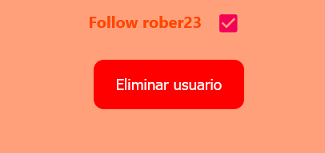

<h1 align="center">Manual de administrador</h1>
 
<h2 align="center">Red social de videojuegos, “Player2”</h1>
 
<h2 align="center">IES Puerto de la Cruz - Telesforo Bravo</h1>

 
 
<h2 align="center">Autores:</h1>
<h4 align="center">Ricardo Baloira Armas</h4>
<h4 align="center">Daniel Barroso Rocío</h4>

 
 

## **Índice:**

[**1. Introducción**](#id1)

[1.1 Funcionalidades generales](#id1.1)

[**2. Acciones sobre juegos**](#id2)

[2.1 Crear juego](#id2.1)

[2.2 Modificar juego](#id2.2)

[2.3 Eliminar juego](#id2.3)

[**3. Acciones sobre pistas y reviews**](#id3)

[3.1 Eliminar pistas y reviews](#id3.1)

[**4. Acciones sobre usuarios**](#id4)

[4.1 Crear y eliminar usuario administrador](#id4.1)

[4.2 Eliminar usuario](#id4.2)

[**5. Acciones sobre géneros**](#id5)

[5.1 Crear y eliminar géneros](#id5.1)

# **1. Introducción** 

## **1.1 Funcionalidades generales** 

Al iniciar sesión como un administrador el usuario será redirigido a la vista Home, al igual que el resto de usuarios sin permisos de administrador. Este usuario puede realizar todas las acciones a las que los usuarios no administradores tienen acceso, pero adicionalmente cuenta con las opciones de realizar acciones sobre los juegos registrados de la página (crear, modificar y eliminar), el resto de usuarios (eliminar y crear usuario administrador), las pistas y reviews (eliminar) y los géneros que sirven para clasificar los distintos juegos (crear y eliminar).

Procederemos a explicar en las siguientes páginas dónde y cómo puede realizar el administrador estas acciones.

# **2. Acciones sobre juegos** 

## **2.1 Crear juego** 

El administrador podrá acceder a la vista de creación de juegos desde la vista Home, pulsando el botón “Crear juego” situado sobre el listado de videojuegos en tendencia.

 

Una vez dentro de la vista el administrador deberá rellenar los distintos campos con los datos del juego a agregar a Player2, especificando en este orden su título, fecha (en formato yyyy-MM-dd, es decir primero el año, después el mes y por último el día), la url de la imagen a usar para identificar el juego y la descripción que este contendrá. También podrá el administrador detallar aquellos géneros a los que el juego pertenece marcando las checkboxes correspondientes situadas a la izquierda de los campos anteriormente mencionados, bajo el título “Géneros”.

Una vez el administrador haya terminado de especificar los datos del juego podrá proceder a su creación pulsando el botón “Crear”, añadiéndose de inmediato este nuevo juego a la vista Videojuegos, dentro del listado que agrupa a todos los juegos.

## **2.2 Modificar juego** 

Para modificar un juego el administrador deberá, dentro de la ficha del juego que desea modificar, pulsar el botón “Modificar videojuego” situado en la parte superior, junto al botón “Eliminar videojuego”.

Al hacerlo el administrador accederá a la vista donde poder modificar el juego, en la cual se mostrarán los mismos campos presentes en la vista de creación de juegos rellenos con los datos del juego en cuestión, con la excepción del listado de checkboxes que representan los géneros existentes, los cuales estarán todos desmarcados por defecto.

Una vez termine el administrador de modificar los datos que crea conveniente solo quedará presionar el botón “Modificar” para que el juego sea editado correctamente, mostrándose de inmediato los cambios en la ficha del juego.

## **2.3 Eliminar juego** 

Para eliminar un juego el administrador deberá, dentro de la ficha del juego que desea eliminar, pulsar el botón “Eliminar videojuego” situado en la parte superior, junto al botón “Modifcar videojuego”.

Al hacerlo el juego será eliminado automáticamente, siendo el administrador dirigido fuera del ficha del juego en cuestión, pues este ya no existe en Player2.

# **3. Acciones sobre pistas y reviews** 

## **3.1 Eliminar pistas y reviews** 

El administrador podrá eliminar aquellas pistas y reviews listadas dentro de las fichas de los juegos que considere inadecuadas. Para ello deberá acceder a la ficha de un juego y, bajo la review o pista que desee eliminar, pulsar el botón “Eliminar pista” o “Eliminar review”, según sea el caso. Al hacerlo la pista o review será eliminada automáticamente, desapareciendo de inmediato de la ficha del juego.

# **4. Acciones sobre usuarios** 

## **4.1 Crear y eliminar usuario administrador** 

El administrador podrá acceder a la vista donde crear un nuevo administrador desde la vista Videojuegos, pulsando el botón “Agregar Admin” situado junto al botón “Modificar géneros”.

Dentro de ella se mostrarán listados todos los usuarios administradores existentes en la base de datos de Player2, pudiendo el administrador crear un nuevo administrador rellenando los campos del primer formulario con el nombre y password que tendrá este nuevo usuario y, a continuación, pulsando “Crear”. Si el administrador desea eliminar a otro administrador, no obstante, deberá escribir en el campo del segundo formulario su id, que es el número que se muestra a la izquierda de su nombre en el listado de administradores de la parte superior de la vista. A continuación solo deberá pulsar “Eliminar” para que este administrador sea eliminado automáticamente de Player2.

## **4.2 Eliminar usuario** 

El administrador podrá eliminar cualquier usuario de Player2, debiendo para ello acceder al perfil de dicho usuario, ya sea clicando su avatar presente en una de las vistas de Player2 o buscándolo directamente por su nombre desde la barra de búsqueda de la vista Social. Una vez dentro del perfil del usuario que se desea eliminar, el administrador deberá pulsar el botón “Eliminar usuario” situado en la parte superior de la vista, eliminándose automáticamente dicho usuario de la base de datos de Player2.

# **5. Acciones sobre géneros** 

## **5.1 Crear y eliminar géneros** 

El administrador podrá acceder a la vista donde crear un nuevo género desde la vista Videojuegos, pulsando el botón “Modificar géneros” situado junto al botón “Agregar Admin”.

Dentro de ella se mostrarán listados todos los géneros existentes en la base de datos de Player2, pudiendo el administrador crear un nuevo género rellenando el campo del formulario situado en la esquina inferior izquierda con el nombre que tendrá este nuevo género y, a continuación, pulsando “Crear”. Si el administrador desea eliminar un género, no obstante, deberá escribir en el campo del formulario situado a la derecha del formulario anterior el id del género a eliminar, que es el número que se muestra a la izquierda de su nombre en el listado de géneros de la parte superior de la vista. A continuación solo deberá pulsar “Eliminar” para que este género sea eliminado automáticamente de Player2.

