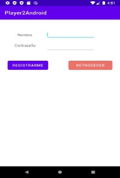
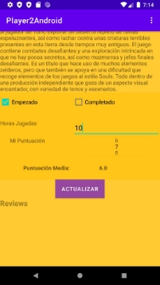

**Manual de usuario**

**Red social de videojuegos, “Player2”**

**\_\_\_\_\_\_\_\_\_\_\_\_\_\_\_\_\_\_\_\_\_\_\_\_\_\_\_\_\_\_\_\_\_\_\_\_\_\_\_\_\_\_\_\_\_\_\_\_\_\_\_\_\_\_\_\_\_\_\_\_\_\_\_\_\_\_\_ \_\_\_\_\_**

**IES Puerto de la Cruz - Telesforo Bravo**

**Autores:**

Ricardo Baloira Armas Daniel Barroso Rocío

**Índice**

1. [**Introducción](#_page2_x72.00_y72.00) **[3**](#_page2_x72.00_y72.00)**
1. [Vista principal](#_page2_x72.00_y115.54) [3](#_page2_x72.00_y115.54)
1. [Login](#_page2_x72.00_y570.92) [4](#_page2_x72.00_y570.92)
1. [Registro](#_page3_x72.00_y380.24) [4](#_page3_x72.00_y380.24)
1. [Cerrar sesión](#_page4_x72.00_y349.64) [5](#_page4_x72.00_y349.64)
2. [**Vista Home](#_page5_x72.00_y72.00) **[6**](#_page5_x72.00_y72.00)**

[2.1 Listado de actividades](#_page5_x72.00_y115.54) [6](#_page5_x72.00_y115.54)

3. [**Vista Videojuegos](#_page7_x72.00_y72.00) **[8**](#_page7_x72.00_y72.00)**
1. [Listados](#_page7_x72.00_y115.54) [8](#_page7_x72.00_y115.54)
1. [Opciones de filtro](#_page8_x72.00_y72.00) [9](#_page8_x72.00_y72.00)
4. [**Ficha de un juego](#_page9_x72.00_y72.00) **[10**](#_page9_x72.00_y72.00)**
   1. [Introducción](#_page9_x72.00_y115.54) [10](#_page9_x72.00_y115.54)
   1. [Agregar a lista y puntuar](#_page11_x72.00_y72.00) [12](#_page11_x72.00_y72.00)
   1. [Ver y publicar pistas](#_page12_x72.00_y72.00) [13](#_page12_x72.00_y72.00)
   1. [Ver y publicar reviews](#_page13_x72.00_y72.00) [14](#_page13_x72.00_y72.00)
5. [**Vistas del perfil](#_page14_x72.00_y72.00) **[15**](#_page14_x72.00_y72.00)**
1. [Introducción](#_page14_x72.00_y115.54) [15](#_page14_x72.00_y115.54)
1. [Vista Principal](#_page15_x72.00_y72.00) [16](#_page15_x72.00_y72.00)
1. [Vista Videojuegos](#_page18_x72.00_y72.00) [20](#_page18_x72.00_y72.00)
1. [Vista Social](#_page19_x72.00_y72.00) [21](#_page19_x72.00_y72.00)
1. [Vista Reviews](#_page21_x72.00_y72.00) [23](#_page21_x72.00_y72.00)
1. [Vista Ajustes](#_page22_x72.00_y72.00) [24](#_page22_x72.00_y72.00)
1. **Introducción**
1. **Vista principal**

Al acceder a Player2 el usuario será dirigido por defecto a esta vista donde se le mostrarán como dos únicas opciones acceder a la vista donde poder iniciar sesión (botón “LOGIN”) o acceder a la vista donde poder registrarse como un nuevo usuario (botón “REGISTRO”).

2. **Login**

Al pulsar sobre el botón “LOGIN” en la vista principal el usuario accederá a esta vista, donde se le presentarán los siguientes elementos:

- Un botón “RETROCEDER”, que le permitirá al usuario regresar a la vista

anterior con las opciones de acceder al login, o al registro.

- Dos campos, “Nombre” y “Contraseña”, los cuales el usuario deberá rellenar

con dichos datos para iniciar sesión.

- Un botón “LOGIN”, el cual al pulsarlo el usuario, previa comprobación de que

se han rellenado los campos “Nombre” y “Contraseña” con datos de un usuario existente, iniciará sesión con su cuenta y será dirigido al Home de la aplicación.

3. **Registro**

Al pulsar sobre el botón “REGISTRO” en la vista principal el usuario accederá a esta vista, donde se le presentarán los siguientes elementos:

- Un botón “RETROCEDER”, que le permitirá al usuario regresar a la vista del

main con las opciones de acceder al login, o al registro.

- Dos campos, “Nombre” y “Contraseña”, los cuales el usuario deberá rellenar

con dichos datos para registrarse.

- Un botón “REGISTRARME”, el cual al pulsarlo el usuario, previa

comprobación de que se han rellenado los campos “Nombre” y “Contraseña” con datos válidos (introduciendo un nombre que no esté en uso por otro usuario existente), se registrará como usuario de la aplicación y podrá iniciar sesión desde la vista del login utilizando los datos ahora introducidos en el registro.

4. **Cerrar sesión**

Para cerrar sesión el usuario deberá, desde cualquiera de las vistas ajenas a su perfil, seleccionar desde el menú (situado en la esquina superior derecha de la pantalla) la opción “Cerrar sesión”. De este modo, se cerrará la sesión actual y el usuario será dirigido a la vista del login.

2. **Vista Home**

**2.1 Listado de actividades**

En esta vista, a la cual accederá el usuario al iniciar sesión o al pulsar en el menú la opción “Home”, se muestran las últimas actividades, ordenadas de más antigua a más reciente, de aquellos usuarios a los que sigue el usuario. Estas actividades mostrarán, en función de la acción realizada por dicho usuario, el juego que él o ella agregó a su lista personal o acerca del cual publicó una review o pista, indicándose en la actividad además del título de dicho juego y la acción realizada la fecha en la cual tuvo lugar, junto al nombre y avatar del usuario en cuestión. Al clicar sobre este avatar o nombre de usuario se dirigirá al usuario al perfil del usuario que realizó la actividad, en tanto que si este pulsa sobre cualquier otro elemento de la actividad se le dirigirá a la ficha del juego sobre el cual se llevó a cabo la acción.

Si el usuario no sigue a ningún usuario solamente se le mostrará en este pantalla un mensaje sobre una pantalla en blanco informando de que no hay actividades a mostrar para el usuario.

3. **Vista Videojuegos**
1. **Listados**

En esta vista, a la cual se accede mediante la opción de menú “Lista videojuegos”, se muestran listados los juegos existentes en la base de datos de Player2, los cuales podrá observar el usuario deslizando la lista hacia abajo y arriba y, si lo desea, observar la ficha de un juego en concreto haciendo clic sobre el juego en cuestión dentro de la lista.

2. **Opciones de filtro**

En la parte superior de la vista se muestran distintas opciones de filtro, las cuales el usuario puede usar simultáneamente para, tras pulsar el botón “FILTRAR”, aplicar dichos filtros al listado y que de esta forma se muestren solo aquellos juegos que cumplan con los requisitos especificados. Estos filtros incluyen:

- Filtrar por orden: al seleccionar una de las opciones mostradas en el apartado

“Ordenar por” se le permitirá al usuario aplicar filtros por fecha (de fecha de salida más antigua a la más reciente), título (orden alfabético) y puntuación (videojuego con menor puntuación media a videojuego con mayor puntuación media).

- Filtrar por género: el apartado “Género” permite al usuario seleccionar uno de

los géneros existentes en la base de datos para que de esta forma solo se muestren aquellos juegos que estén clasificados en dicho género. Cabe señalar que un videojuego puede encuadrarse en más de un género, por lo que este se mostrará en más de una opción de filtrado de este tipo.

Si el usuario desea eliminar los filtros efectuados y devolver el listado a su forma original, mostrando todos los juegos existentes en la base de datos, solo debe de pulsar el botón “QUITAR FILTROS”.

4. **Ficha de un juego**
1. **Introducción**

En esta vista, a la que el usuario podrá acceder al hacer clic sobre el nombre o imagen de uno de los juegos mostrados en cualquier vista de la aplicación, se presentan los siguientes datos del juego:

- Su título e imagen.
- Su nota media, en base a las puntuaciones dadas al juego por los distintos

usuarios de la página que tienen el juego en cuestión en su lista de juegos.

- Checkboxes indicadores de si el usuario tiene el juego en su lista de juegos y

si lo ha completado o no (elemento solo visible si el usuario tiene el juego dentro de su lista personal o pulsa el checkbox “Empezado” en primer lugar).

- Horas jugadas por el usuario al juego en cuestión (elemento solo visible si el

usuario tiene el juego dentro de su lista personal o pulsa el checkbox “Empezado” en primer lugar).

- Puntuación dada por el usuario al juego en cuestión (elemento solo visible si

el usuario tiene el juego dentro de su lista personal o pulsa el checkbox “Empezado” en primer lugar).

- Descripción.
- Lista de pistas del juego publicadas por los usuarios.
- Lista de reviews del juego publicadas por los usuarios.

2. **Agregar a lista y puntuar**

Clicando sobre el checkbox mencionado en la sección anterior, “Empezado”, el usuario agregará el juego a su lista personal, apareciendo por consiguiente este registrado en la base de datos como uno de los juegos en progreso del usuario.

Al hacer clic sobre este checkbox aparecerá el checkbox para clasificar este juego como completado (“Completado”), el cual al ser pulsado provocará que el juego pase de ser un juego en progreso del usuario a uno completado. También se mostrarán las horas jugadas a este juego por el usuario, las cuales por defecto serán 0 y podrán actualizarse rellenando el campo en cuestión con el número de horas y pulsando en “Enviar”, y la puntuación dada al juego por el usuario, que por defecto será un 5 y podrá actualizarse por medio de la barra deslizante, influyendo al instante en la nota media que tiene el juego en Player2. Por último, señalar que al pulsar el botón “ACTUALIZAR” serán modificados inmediatamente los datos de la base de datos con respecto a la relación del usuario con el juego en cuestión para reflejar los cambios efectuados por el usuario en la ficha de este último.

3. **Ver y publicar pistas**

Bajo el título “Pistas” se mostrarán listadas las pistas publicadas por los usuarios de Player2 del juego en cuestión, mostrándose el título dado a la pista, autor y contenido. Clicando sobre la pista el usuario será redirigido al perfil de su autor.

Si pulsa sobre el botón “HACER PISTA” el usuario será dirigido a una vista donde podrá publicar una pista para el juego desde cuya ficha accedió a esta pantalla, debiendo para ello que introducir un título y contenido para la pista en cuestión para, a continuación, pulsar el botón “PUBLICAR”.

4. **Ver y publicar reviews**

Bajo el título “Reviews” se mostrarán listadas las reviews publicadas por los usuarios de Player2 del juego en cuestión, mostrándose el título dado a la review, autor y contenido. Clicando sobre la pista el usuario será redirigido al perfil de su autor.

Si pulsa sobre el botón “HACER REVIEW” el usuario será dirigido a una vista donde podrá publicar una review para el juego desde cuya ficha accedió a esta pantalla, debiendo para ello que introducir un título y contenido para la review en cuestión y, a continuación, pulsar el botón “PUBLICAR”.

5. **Vistas del perfil**
1. **Introducción**

Para acceder al perfil el usuario podrá, en el menú superior visible en todas las vistas de Player2 ajenas a las vistas del perfil, clicar sobre “Perfil”.

Al hacerlo el usuario será dirigido a la vista principal de su perfil.

2. **Vista Principal**

Esta vista, a la que el usuario accederá por defecto al visitar su perfil y también clicando sobre “Perfil” enel menú superior de las vistas encuadradas dentro del perfil, está compuesta por las siguientes cinco secciones:

- Sobre mí: en esta sección se mostrará la información publicada por el usuario

sobre sí mismo desde la vista Ajustes.

- Géneros favoritos: en esta sección se mostrarán los tres géneros favoritos del

usuario, en base a los tres géneros más repetidos de entre los juegos que este tiene en su lista personal. Aparte, también se mostrará sobre el nombre del género el número de juegos de la lista del usuario que pertenecen a dicho género.

- Estadísticas del usuario: en la esquina superior derecha de la vista se

mostrarán el número total de juegos que tiene el usuario en su lista personal (“Total videojuegos”), el número de días que ha jugado el usuario en base a las horas registradas por este en cada juego de su lista personal (“Días jugados”) y su puntuación media, valor obtenido en base a la media de todas las puntuaciones dadas por el usuario a todos aquellos juegos puntuados por este (“Puntuación media”).

- Actividad: esta sección funciona igual que la sección de mismo nombre de la

vista Home con la diferencia de que, en lugar de mostrarse la actividad de aquellos usuarios a los que sigue el usuario, se muestra la actividad del propio usuario.

- Videojuegos mejor puntuados: en esta sección se mostrarán los tres juegos

de la lista personal del usuario mejor puntuados por este, debiendo estos primero contar con una nota mínima de 7 sobre 10 para poder aparecer en esta sección en primer lugar.

Por último, señalar que en caso de visitar el usuario el perfil de otro usuario se le mostrará la vista de su pestaña Principal, apareciendo en la parte superior un botón (“FOLLOW” o “UNFOLLOW”, según si se sigue o no a dicho usuario) cuya activación permitirá al usuario agregar a dicha persona o eliminar a dicha persona de su lista de usuarios seguidos.

3. **Vista Videojuegos**

Esta vista, a la que el usuario podrá acceder al clicar sobre “Videojuegos” en la barra superior de las vistas encuadradas dentro del perfil, está compuesta por dos secciones:

- Listado de juegos: listado donde, según si el usuario pulsa el botón “EN

PROGRESO” o “COMPLETADOS”, se le mostrarán juegos de su lista personal que estén marcados como en progreso o como completados.

- Opciones de filtro: opciones en base a las cuales, una vez pulse el usuario el

botón “FILTRAR”, modificarán los juegos mostrados en el listado antes mencionado para que aparezcan solo aquellos que encajen con los parámetros definidos en estas opciones.

4. **Vista Social**

Esta vista, a la que el usuario podrá acceder al clicar sobre “Social” en el menú superior de las vistas encuadradas dentro del perfil, está compuesta por las siguientes secciones:

- Estadísticas: situada en la parte superior de la vista, esta sección muestra el

número de usuarios que siguen el usuario (“Seguidores”) y el número de usuarios a los que sigue el usuario (“Siguiendo”) al pulsar este los botones “FOLLOWERS” y “FOLLOWING”, respectivamente.

- Barra de búsqueda: en la esquina superior izquierda se encuentra una barra

de búsqueda por medio de la cual el usuario podrá buscar un usuario concreto al escribir su nombre y clicar sobre el botón “BUSCAR”. Al hacerlo, el usuario será dirigido al perfil del usuario buscado, en caso de existir este.

- Listado de usuarios: en la zona inferior de la vista se muestran dos botones

que, al pulsar, muestran un listado de aquellos usuarios que siguen al usuario (“FOLLOWERS”) y un listado de aquellos usuarios a los que sigue el usuario (“FOLLOWING”), pudiendo alternar el usuario entre ambas listas presionando los botones correspondientes en todo momento. Al hacer clic sobre el nombre o avatar de un usuario de estas listas el usuario será dirigido al perfil de dicho usuario.

5. **Vista Reviews**

En esta vista, a la que el usuario podrá acceder al clicar sobre “Reviews” en el menú superior de las vistas encuadradas dentro del perfil, aparecen listadas todas las reviews publicadas por el usuario, mostrándose su título, nombre del autor y su avatar del que se ha realizado la review, a cuya ficha se puede acceder haciendo clic sobre cualquiera de los dos elementos, título e imagen. En caso de no haber realizado el usuario ninguna review se mostrará en su lugar un texto informando de ello.

6. **Vista Ajustes**

Esta vista, a la que el usuario podrá acceder al clicar sobre “Ajustes” en el menú superior de las vistas encuadradas dentro del perfil, está compuesta por las siguientes secciones:

- Color del perfil: en esta sección el usuario tendrá la opción de seleccionar

entre los tres colores listados, rojo, verde y azul, para así cambiar el color de fondo que aparecerá en todas las vistas contenidas en su perfil.

- Avatar: en esta sección el usuario podrá cambiar su imagen de avatar,

teniendo para ello que introducir el enlace de dicha imagen en el campo dispuesto para ello y pulsar sobre el botón “CAMBIAR”.

- Banner: en esta sección el usuario podrá cambiar su imagen de banner,

imagen que se muestra como fondo entre las barras superiores general y del perfil, teniendo para ello que introducir el enlace de dicha imagen en el campo dispuesto para ello y pulsar sobre el botón “CAMBIAR”.

- Sobre mí: en esta sección el usuario podrá cambiar la descripción de sí

mismo que se mostrará en la sección “Sobre mí” de la vista Principal de su perfil, teniendo para ello que introducir rellenar el campo dispuesto para ello y pulsar sobre el botón “CAMBIAR”.
