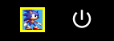
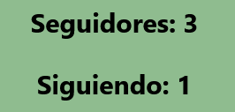
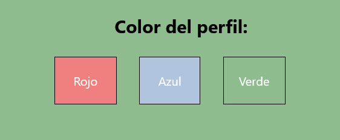

<h1 align="center">Manual de usuario</h1>
 
<h2 align="center">Red social de videojuegos, “Player2”</h1>
 
<h2 align="center">IES Puerto de la Cruz - Telesforo Bravo</h1>

 
 
<h2 align="center">Autores:</h1>
<h4 align="center">Ricardo Baloira Armas</h4>
<h4 align="center">Daniel Barroso Rocío</h4>

 
 

## **Índice:**

[**1. Introducción**](#id1)

[1.1 Usuario no logueado](#id1.1)

[1.2 Login](#id1.2)

[1.3 Registro](#id1.3)

[1.4 Cerrar sesión](#id1.4)

[**2. Vista Home**](#id2)

[2.1 Actividad](#id2.1)

[2.2 Videojuegos en tendencias](#id2.2)

[2.3 Nuevos videojuegos](#id2.3)

[2.4 Tus juegos en progreso](#id2.4)

[**3. Vista Videojuegos**](#id3)

[3.1 Listados](#id3.1)

[3.2 Opciones de filtro](#id3.2)

[**4. Ficha de un juego**](#id4)

[4.1 Introducción](#id4.1)

[4.2 Agregar a lista y puntuar](#id4.2)

[4.3 Ver y publicar pistas](#id4.3)

[4.4 Ver y publicar reviews](#id4.4)

[**5. Vista Perfil**](#id5)

[5.1 Introducción](#id5.1)

[5.2 Vista Principal](#id5.2)

[5.3 Vista Videojuegos](#id5.3)

[5.4 Vista Social](#id5.4)

[5.5 Vista Reviews](#id5.5)

[5.6 Vista Ajustes](#id5.6)

[**6. Vista Chat**](#id6)

[6.1 Introducción](#id6.1)

# **1. Introducción** 

## **1.1 Usuario no logueado** 

Al acceder a Player2 el usuario entrará automáticamente a la vista “Home” de la página como un usuario no logueado, donde podrá observar tanto los videojuegos en tendencia como los más recientes de Player2 y, clicando en cualquier de ellos, consultar su ficha (página x del manual).

Como invitado, el usuario no logueado no tendrá permiso para acceder al chat, a los perfiles de los usuarios de Player2 o a realizar ninguna de las funcionalidades incluidas dentro de la ficha de cada juego, como publicar reviews. Sin embargo, el invitado puede hace uso de las siguientes funcionalidades de la barra superior de la página, visible en todo momento:

- Utilizar la barra de búsqueda situada en la esquina superior derecha para acceder directamente a la ficha de un juego concreto, debiendo para ello escribir su nombre (no es necesario respetar el uso de mayúsculas y minúsculas) y clicar sobre el icono de la lupa o pulsar la tecla Enter.

- Acceder a la vista “Videojuegos” al clicar sobre el nombre en cuestión.
- Acceder a la vista “Home” al clicar sobre el nombre en cuestión.
- Acceder al login al clicar sobre cualquiera de los siguientes iconos:

## **1.2 Login** 

En esta vista el usuario podrá realizar las siguientes acciones:

- Acceder a la vista Home como usuario no logueado al clicar sobre el botón “Continuar como invitado” (consultar página 3 del manual).
- Acceder a la vista donde poder registrarse como usuario de Player2 al clicar sobre el botón “Registrarse” (consultar página 6 del manual).
- Iniciar sesión y acceder a la vista Home como usuario registrado al clicar sobre el botón “Iniciar sesión”. Previamente el usuario deberá haber rellenado los campos “Nombre” y “Contraseña” con los mismos datos que dio al registrarse en la página. De lo contrario, o en caso de haber introducido datos incorrectos, se le avisará por medio de un mensaje de que ha ocurrido un error al iniciar sesión. 

## **1.3 Registro** 

En esta vista el usuario podrá realizar las siguientes acciones:

- Acceder a la vista anterior al hacer clic sobre “Crear cuenta” (página 5 del manual).
- Registrarse en Player2. Para ello deberá rellenar los campos “Nombre” y “Contraseña” y pulsar sobre “Crear cuenta”.

## **1.4 Cerrar sesión** 

Para cerrar sesión el usuario deberá clicar sobre sobre el último icono listado en la barra superior de la página, visible en todas las vistas de Player2.

# **2. Vista Home** 

## **2.1 Actividad** 

En esta sección de la vista se muestran las actividades realizadas en la página por aquellos usuarios que sigue el propio usuario. Estas actividades, que se encuentran ordenadas de más reciente a más antigua, incluyen las siguientes acciones:

- Review publicada por el usuario en la ficha de un juego.
- Pista publicada por el usuario en la ficha de un juego.
- Juego añadido a la lista de juegos del usuario desde la ficha de dicho juego.

Haciendo clic en el avatar del usuario, situado en la esquina superior izquierda del bloque de la actividad en cuestión, el usuario será redirigido al perfil de dicho usuario, al igual que si clica sobre el nombre de dicho usuario. Por otra parte, al hacer clic sobre la acción realizada el usuario accederá directamente a la ficha del juego relacionado con la acción listada. 
## **2.2 Videojuegos en tendencias** 

En esta sección se muestran un máximo de cuatro videojuegos seleccionados de entre el resto por ser los que, en base a su puntuación media, superan a los demás juegos de la página. Esta puntuación media se obtiene al dividir el total de puntuaciones dadas por los usuarios de un juego entre el número de usuarios que han puntuado dicho juego.

Cabe destacar que para ser considerado un juego como juego en tendencia, aparte de superar al resto de juegos de la página en puntuación media, debe tener un mínimo de puntuación media de 7 sobre 10.

## **2.3 Nuevos videojuegos** 

En esta sección se muestran un máximo de cuatro juegos considerados más recientes de la página, en base a su valor de fecha de salida.

## **2.4 Tus juegos en progreso** 

En esta sección se mostrarán listados todos aquellos juegos que el usuario haya agregado a su lista de juegos pero no haya marcado aún como completados desde la ficha de dicho juego (consultar página x del manual). En caso de no contar con ningún juego en su lista que no haya sido completado, no aparecerá listado ningún juego en esta sección.

# **3. Vista Videojuegos** 

## **3.1 Listados** 

En esta sección de la vista se muestran listados los juegos de Player2 en base a distintos parámetros:

- Tendencias: se muestran un máximo de seis videojuegos seleccionados de entre el resto por ser los que, en base a su puntuación media, superan a los demás juegos de la página. Esta puntuación media se obtiene al dividir el total de puntuaciones dadas por los usuarios de un juego entre el número de usuarios que han puntuado dicho juego. Cabe destacar que para ser considerado un juego como juego en tendencia, aparte de superar al resto de juegos de la página en puntuación media, debe tener un mínimo de puntuación media de 7 sobre 10.
- Nuevos: se muestran un máximo de seis juegos considerados más recientes de la página, en base a su valor de fecha de salida.
- Todos: se muestran todos los juegos de la página ordenados según la fecha en que han sido registrados en ella.

## **3.2 Opciones de filtro** 

Aparte de mostrar juegos seleccionados según su novedad o popularidad, esta vista permite al usuario ordenar y seleccionar los juegos a mostrar en base a los siguientes parámetros:

- Ordenar por: este campo permite al usuario seleccionar entre tres métodos de ordenación, puntuación, año y título. Según el método seleccionado aparecerá a la derecha los juegos listados bajo el título “Filtrados por puntuación”, “Filtrados por año de salida” o “Filtrados por título”, pudiendo cambiar el usuario su selección en todo momento.

- Filtro: este campo permite al usuario seleccionar un género de entre todos los géneros existentes en Player2 por los que se categorizan los juegos (los cuales se pueden consultar dentro de la ficha de cada juego). Al seleccionar un género se mostrará a la derecha bajo el título “Filtrados por género” todos los juegos registrados en la página que pertenecen al género seleccionado. Cabe destacar que un juego puede tener más de un género, por lo que es posible que aparezca en más de un listado de juegos filtrados por género.

- Año: por medio de una barra deslizante el usuario podrá seleccionar una fecha a partir de la cual se filtrarán los juegos mostrados a la derecha bajo el título “Filtrados por año”, apareciendo por ejemplo solo aquellos juegos que hayan salido el año 2008 o en posteriores años al seleccionar “2008”.

# **4. Ficha de un juego** 

## **4.1 Introducción** 

En esta vista, a la que el usuario podrá acceder al hacer clic sobre el nombre o imagen de uno de los juegos listados en las distintas vistas de Player2, el usuario podrá observar los siguientes datos de dicho juego:

- Su título e imagen.
- Su nota media, en base a las puntuaciones dadas al juego por los distintos usuarios de la página que tienen el juego en cuestión en su lista de juegos.
- Géneros a los que pertenece el juego.
- Checkboxes indicadores de si el usuario tiene el juego en su lista de juegos y si lo ha completado o no (este segundo elemento solo visible si el usuario tiene el juego registrado en su lista personal).
- Horas jugadas por el usuario al juego en cuestión (elemento solo visible si el usuario tiene el juego registrado en su lista personal).
- Puntuación dada por el usuario al juego en cuestión (elemento solo visible si el usuario tiene el juego registrado en su lista personal).
- Descripción.
- Lista de pistas del juego publicadas por los usuarios.
- Lista de reviews del juego publicadas por los usuarios.

## **4.2 Agregar a lista y puntuar** 

Clicando sobre el checkbox mencionado en la sección anterior, “Añadir a lista”, el usuario agregará el juego a su lista personal, apareciendo por consiguiente este junto al resto de juegos de su lista en la sección “Tus juegos en progreso” de la vista Home y también en la vista “Videojuegos” del perfil del usuario.

Al hacer clic sobre este checkbox aparecerá el checkbox para clasificar este juego como completado (“¿Completado?”), desapareciendo este por tanto del listado de juegos en progreso para mostrarse, dentro de la sección “Videojuegos” del perfil del usuario, en la sección “Juegos completados”. También se mostrarán las horas jugadas a este juego por el usuario, las cuales por defecto serán 0 y podrán actualizarse rellenando el campo en cuestión con el número de horas y pulsando en “Enviar”, y la puntuación dada al juego por el usuario, que por defecto será un 5 y podrá actualizarse por medio de la barra deslizante, influyendo al instante en la nota media que tiene el juego en Player2.

## **4.3 Ver y publicar pistas** 

Bajo el título “Pistas” se mostrarán listadas las pistas publicadas por los usuarios de Player2 del juego en cuestión, mostrándose el título dado a la pista, autor, fecha de publicación y contenido. Clicando sobre el avatar o nombre del autor el usuario será redirigido al perfil de dicho usuario.

Al final del listado el usuario tendrá opción de publicar una pista pulsando sobre el botón “Crear Pista”. Al hacerlo será redirigido a una vista en la que para crear la pista deberá rellenar los campos del título (el campo superior) y contenido (el campo inferior) de la pista para seguidamente pulsar en “Crear Pista”. Si se ha creado la pista el usuario será enviado directamente a la ficha del juego del que creó la pista, en tanto que si ha ocurrido un error se mostrará un mensaje de alerta en la misma vista de crear pista.

## **4.4 Ver y publicar reviews** 

Bajo el título “Reviews” se mostrarán listadas las reviews publicadas por los usuarios de Player2 del juego en cuestión, mostrándose el título dado a la review, autor, fecha de publicación y contenido. Clicando sobre el avatar o nombre del autor el usuario será redirigido al perfil de dicho usuario.

Al final del listado el usuario tendrá opción de publicar una review pulsando sobre el botón “Crear Review”. Al hacerlo será redirigido a una vista en la que para crear la review deberá rellenar los campos del título (el campo superior) y contenido (el campo inferior) de la review para seguidamente pulsar en “Crear Review”. Si se ha creado la review el usuario será enviado directamente a la ficha del juego del que creó la review, en tanto que si ha ocurrido un error se mostrará un mensaje de alerta en la misma vista de crear review.

# **5. Vista Perfil** 

## **5.1 Introducción** 

Para acceder al perfil el usuario podrá, en la barra superior visible en todas las vistas de Player2, clicar sobre “Perfil” o sobre su propio avatar, situado en la esquina superior derecha junto al botón para cerrar sesión.

Al hacerlo el usuario será dirigido a la vista Principal de su perfil

## **5.2 Vista Principal** 

Esta vista, a la que el usuario accederá por defecto al visitar su perfil y también clicando sobre “Principal” en la barra superior de las vistas encuadradas dentro del perfil, está compuesta por las siguientes cinco secciones:

- Sobre mí: en esta sección se mostrará la información publicada por el usuario sobre sí mismo desde la vista Ajustes. En caso de no haber redactado información para esta sección el único texto visible será “El usuario no ha escrito nada”.

- Géneros favoritos: en esta sección se mostrarán los tres géneros favoritos del usuario, en base a los tres géneros más repetidos de entre los juegos que este tiene en su lista personal. Aparte, también se mostrará sobre el nombre del género el número de juegos de la lista del usuario que pertenecen a dicho género.

- Estadísticas: en la esquina superior derecha de la vista se mostrarán el número total de juegos que tiene el usuario en su lista personal (“Total videojuegos”), el número de días que ha jugado el usuario en base a las horas registradas por este en cada juego de su lista personal (“Días jugados”) y su puntuación media, valor obtenido en base a la media de todas las puntuaciones dadas por el usuario a todos aquellos juegos puntuados por este (“Puntuación media”).

 

- Actividad: esta sección funciona igual que la sección de mismo nombre de la vista Home con la diferencia de que, en lugar de mostrarse la actividad de aquellos usuarios a los que sigue el usuario, se muestra la actividad del propio usuario.

- Videojuegos mejor puntuados: en esta sección se mostrarán los tres juegos de la lista personal del usuario mejor puntuados por este, debiendo estos primero contar con una nota mínima de 7 sobre 10 para poder aparecer en esta sección en primer lugar.

Por último, señalar que en caso de visitar el usuario el perfil de otro usuario se le mostrará la vista de su pestaña Principal, apareciendo en la parte superior un checkbox (“Follow” seguido del nombre del usuario) cuya activación permitirá al usuario agregar a dicha persona a su lista de usuarios seguidos, pudiendo en cualquier momento desmarcar dicho checkbox para eliminar al usuario de dicha lista.

## **5.3 Vista Videojuegos** 

Esta vista, a la que el usuario podrá acceder al clicar sobre “Videojuegos” en la barra superior de las vistas encuadradas dentro del perfil, está compuesta por dos secciones:

- Juegos listados: se listan en esta sección tanto los juegos de la lista personal del usuario que no han sido marcados como completados (“Juegos en progreso”) como aquellos que lo han sido (“Juegos completados”). Al igual que en otras vistas, el usuario podrá acceder a la ficha del juego en cuestión clicando sobre su imagen o nombre.

- Filtro: esta sección ofrece las mismas funcionalidades que la sección “Opciones de filtro” situada dentro de la vista “Videojuegos” fuera del perfil del usuario (consultar página 13 del manual), con el agregado de poder en esta sección el usuario filtrar también los juegos por su nombre al rellenar la barra situada bajo el título “Nombre” con el nombre a filtrar y pulsar sobre el icono de la lupa o presionar la tecla Enter. Al hacerlo se mostrarán a la derecha bajo el título “Filtrados por nombre” aquellos juegos que contienen en su título la palabra escrita por el usuario en la barra. Debe tenerse en cuenta también que todas estas opciones de filtro se aplican únicamente a los juegos registrados en la lista personal del usuario, nunca mostrándose en los resultados de los filtros un juego que no haya agregado el usuario a su lista pese a encajar sus parámetros con los datos de búsqueda.

## **5.4 Vista Social** 

Esta vista, a la que el usuario podrá acceder al clicar sobre “Social” en la barra superior de las vistas encuadradas dentro del perfil, está compuesta por las siguientes secciones:

- Estadísticas: situada en la parte superior de la vista, esta sección muestra el número de usuarios que siguen el usuario (“Seguidores”) y el número de usuarios a los que sigue el usuario (“Siguiendo”).

- Barra de búsqueda: en la esquina superior izquierda se encuentra una barra de búsqueda por medio de la cual el usuario podrá buscar un usuario concreto al escribir su nombre (no es necesario respetar mayúsculas y minúsculas) y clicar sobre el icono de lupa o presionar la tecla Enter. Al hacerlo, el usuario será dirigido al perfil del usuario buscado, en caso de existir este.

- Listado de usuarios: en esta sección aparecen listados por defecto aquellos usuarios a los que sigue el usuario, pudiendo alternar el usuario entre los usuarios que sigue y los usuarios que lo están siguiendo presionando los botones “Followers” (usuarios que le siguen) y “Following” (usuarios que está siguiendo). Al hacer clic sobre el nombre o avatar de un usuario el usuario será dirigido al perfil de dicho usuario.

## **5.5 Vista Reviews** 

En esta vista, a la que el usuario podrá acceder al clicar sobre “Reviews” en la barra superior de las vistas encuadradas dentro del perfil, aparecen listadas todas las reviews publicadas por el usuario de más reciente a más antigua, mostrándose su título, y el título e imagen del juego del que se ha realizado la review, a cuya ficha se puede acceder haciendo clic sobre cualquiera de los dos elementos, título e imagen. En caso de no haber realizado el usuario ninguna review se mostrará en su lugar un texto informando de ello.

## **5.6 Vista Ajustes** 

Esta vista, a la que el usuario podrá acceder al clicar sobre “Ajustes” en la barra superior de las vistas encuadradas dentro del perfil, está compuesta por las siguientes secciones:

- Color del perfil: en esta sección el usuario tendrá la opción de seleccionar entre los tres colores listados, rojo, verde y azul, para así cambiar el color de fondo que aparecerá en todas las vistas contenidas en su perfil.

- Avatar: en esta sección el usuario podrá cambiar su imagen de avatar, teniendo para ello que introducir el enlace de dicha imagen en el campo dispuesto para ello y pulsar sobre el botón “Cambiar”.

- Banner: en esta sección el usuario podrá cambiar su imagen de banner, imagen que se muestra como fondo entre las barras superiores general y del perfil, teniendo para ello que introducir el enlace de dicha imagen en el campo dispuesto para ello y pulsar sobre el botón “Cambiar”.

- Sobre mí: en esta sección el usuario podrá cambiar la descripción de sí mismo que se mostrará en la sección “Sobre mí” de la vista Principal de su perfil, teniendo para ello que introducir rellenar el campo dispuesto para ello y pulsar sobre el botón “Cambiar”.

# **6. Vista Chat** 

## **6.1 Introducción** 

Para acceder a esta vista el usuario deberá pulsar sobre el siguiente icono situado en la barra superior visible en todas las vistas de Player2:

Al hacerlo accederá a una vista donde aparecerán listados todos los usuarios a los que el usuario sigue y que estos, a su vez, siguen al propio usuario, mostrándose el nombre y avatar de dichos usuarios de la siguiente manera:

Al hacer clic sobre uno de estos recuadros el usuario accederá a una vista en la que podrá intercambiar mensajes con el usuario en cuestión. Para ello, deberá de rellenar el campo que allí se muestra con su mensaje y pulsar el botón situado a la derecha para enviarlo. 

Asimismo, el usuario podrá retroceder a la vista anterior en todo momento pulsando sobre el icono de la flecha situado en la esquina superior izquierda.

